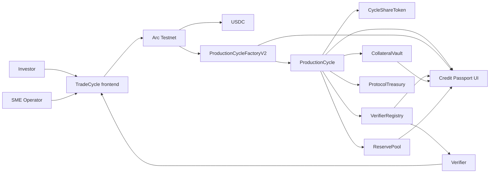

# TradeCycle Architecture

TradeCycle is a USDC milestone-finance workflow for SME production and trade cycles on Arc Testnet. The current implementation uses Arc and USDC directly. Circle Gateway, CCTP / Bridge Kit, Circle Wallets, and USYC are documented as architecture-ready, future, or gated paths only.

## System diagram

## Main components

- **TradeCycle frontend**: Next.js app for investors, SME operators, verifiers, admin views, the guided demo, Circle funding map, submission fit page, and Credit Passport.
- **ProductionCycleFactoryV2**: records operator application/approval state and creates cycle contracts.
- **ProductionCycle**: holds USDC funding, records cycle terms, tracks milestone evidence, releases tranches, accepts repayment, distributes proceeds, and exposes default actions.
- **CycleShareToken**: tokenized investor position for a specific cycle.
- **CollateralVault**: stores operator collateral and supports release/recovery paths.
- **VerifierRegistry**: manages verifier staking, quorum, milestone approvals, and verifier rewards.
- **ReservePool**: protocol reserve support for loss/recovery flows.
- **ProtocolTreasury**: receives protocol fee flows.
- **Credit Passport UI**: reads available onchain cycle and registry signals for an operator profile.

## USDC funding path

1. Investor connects a wallet on Arc Testnet.
2. Investor holds or obtains USDC.
3. Investor approves USDC for the selected `ProductionCycle`.
4. Investor calls the cycle funding action.
5. USDC remains in the cycle contract until milestone or settlement conditions are met.
6. Investor receives cycle-share tokens representing the funded position.

## Milestone escrow and release

Each production cycle has staged milestones. Operator capital is not released all at once. The operator submits evidence, verifiers approve it, and the operator can release the corresponding tranche after quorum is reached.

## Evidence and verifier quorum

The cycle contract exposes evidence submission fields such as evidence CID/hash and evidence timestamps where available. `VerifierRegistry` tracks approval counts and quorum state for milestones. The UI reads this data for cycle details, verifier review, operator dashboard flows, and Credit Passport summaries.

## Repayment waterfall

After the real-world production or trade cycle completes, the operator repays the expected revenue amount into the cycle contract. The protocol then distributes value according to the cycle rules, including investor payout, verifier rewards, reserve allocation, and protocol treasury fees. Investors withdraw from the Portfolio page after distribution.

## Default and collateral recovery path

If a cycle exceeds its duration or cannot complete, the contracts expose a default path. Collateral and reserve mechanisms are available to support recovery. The UI shows default controls where the current cycle state allows them.

## Credit Passport signal derivation

The Credit Passport does not invent offchain credit data. It derives a demo score and profile from readable onchain signals:

- cycles created by the operator
- cycle state
- capital required and raised
- completed/distributed cycles
- defaulted cycles
- submitted and approved milestone counts where readable
- collateral fields where readable
- verifier quorum and reserve support where readable

If a value cannot be read from the current deployment, the UI uses a fallback such as `Not available from current deployment.` The score is a demo score, not a regulated credit rating.

## Circle expansion paths

Implemented today:

- Arc as smart-contract settlement layer
- USDC for funding, escrow, milestone release, repayment, fees, and withdrawals

Architecture-ready or future:

- **Circle Gateway**: unified USDC liquidity for investors, treasury routing, reserve pool funding, operator payouts, and multi-party settlement movement.
- **CCTP / Bridge Kit**: cross-chain USDC funding and settlement when investors start from another chain and settle on Arc.
- **Circle Wallets**: embedded wallet onboarding for non-crypto-native SMEs, investors, and verifiers.
- **USYC**: gated/enterprise concept for idle treasury, reserve, or inventory float. Not implemented unless access is granted.
