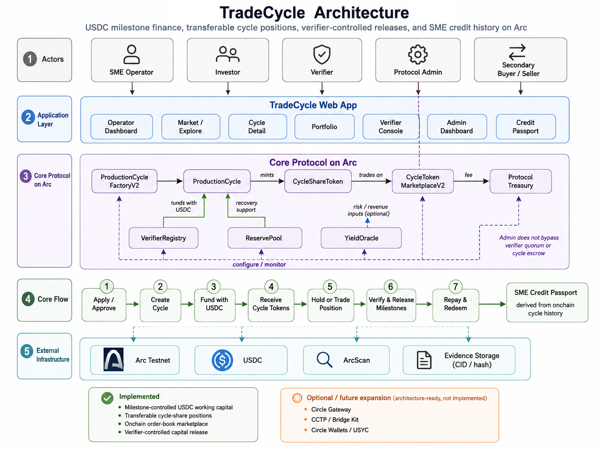

# TradeCycle Submission Document

## Project title

TradeCycle - USDC milestone finance for SMEs on Arc

## Project description

TradeCycle lets SMEs raise USDC for real production and trade cycles, releases capital through verifier-approved milestones, gives investors transferable cycle-share positions that can trade through an onchain order book, and distributes repayment to current token holders. Completed cycles then contribute to an SME Credit Passport.

## Selected track

Best SME Trade Finance & Working Capital Workflow

## Circle Developer Account

`quadriabdulkabirlekan@gmail.com`

## Products used

Implemented:

- Arc Testnet
- USDC

Future or not implemented:

- Circle Gateway
- CCTP / Bridge Kit
- Circle Wallets
- USYC

Not used:

- StableFX
- Nanopayments

## Functional MVP

The deployed MVP includes operator application and policy-gated entry, cycle creation, collateral, USDC funding and escrow, cycle-share minting, an escrowed partial-fill marketplace, milestone evidence, verifier quorum, tranche release, exact repayment, current-holder settlement and recovery, portfolio views, protocol statistics, Admin operations, and Credit Passport profiles.

## Architecture

ProductionCycleFactoryV2 creates per-cycle ProductionCycle and CycleShareToken contracts. VerifierRegistry controls staked-verifier quorum. CollateralVault, ReservePool, ProtocolTreasury, and YieldOracle provide collateral, recovery, economics, and optional transparent estimate inputs. CycleTokenMarketplaceV2 provides the implemented USDC order book. LiquidityManager and LiquidityVault are separately gated advanced infrastructure.

See [Architecture](../ARCHITECTURE.md) for system boundaries and permission diagrams.

## Core contracts

- ProductionCycleFactoryV2
- ProductionCycle
- CycleShareToken
- VerifierRegistry
- CollateralVault
- ReservePool
- ProtocolTreasury
- YieldOracle
- CycleTokenMarketplaceV2

Current Arc Testnet addresses are listed in [Deployments](../DEPLOYMENTS.md).

## Marketplace and current-holder settlement

Primary funding mints transferable shares. Marketplace listings escrow seller shares and support partial or full USDC fills. Sellers receive gross proceeds minus the treasury trading fee. Settlement and default recovery follow current token ownership. Liquidity depends on listings and counterparties and is not guaranteed.

## Admin and risk-control layer

The owner-gated Admin dashboard supports operator-entry policy and manual application review, treasury and reserve operations, marketplace monitoring, transparent YieldOracle inputs, and separately gated liquidity infrastructure. These controls do not replace ProductionCycle state enforcement or verifier quorum. The testnet release does not claim decentralized governance.

## Application and source

- **Working application:** https://tradecycle-arc.vercel.app/
- **GitHub repository:** https://github.com/Quenine/tradecycle-arc
- **Product demo:** `https://drive.google.com/file/d/1KywVEa2Po4EEqDWDdXum-bsBpjGeQvzr/view?usp=sharing`

## Documentation

- [README](../../README.md)
- [Protocol guide](../PROTOCOL_GUIDE.md)
- [Architecture](../ARCHITECTURE.md)
- [Development](../DEVELOPMENT.md)
- [Deployments](../DEPLOYMENTS.md)
- [Testing](../TESTING.md)
- [Security](../../SECURITY.md)
- [Circle Product Feedback](CIRCLE_PRODUCT_FEEDBACK.md)

## Limitations and disclaimer

TradeCycle is unaudited Arc Testnet software and must not be used with real funds. Marketplace lifecycle restrictions after settlement are currently enforced by the frontend rather than the marketplace contract. Liquidity, counterparties, ask prices, and exit timing are not guaranteed. Credit Passport is not a regulated credit rating or lending decision. Owner-controlled functions and production-hardening requirements are documented in the security and protocol guides.